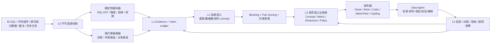

# 目标架构：Evidence-to-Semantics Control Plane

## 1. 总体分层



关键原则：证据、候选、规范定义和运行时产物是不同层，不能共用一个“entity”表或一个 confidence 字段。

## 2. 核心实体

### Source 与运行

- `SourceAsset`：工作簿、API 导出、日志分区、元数据快照。
- `SourceSnapshot`：内容哈希、采集时间、来源系统版本、权限域。
- `IngestionRun` / `ExtractionRun` / `ResolutionRun` / `PublicationRun`：输入、代码版本、配置、模型、输出和状态。

### 确定事实

- `QueryOccurrence`：某组件在某时间观察到的一次 SQL 使用；不因 SQL 文本相同而丢失频次和上下文。
- `SQLAstFact`：表、字段依赖、投影、聚合、过滤、join、group、order、limit、placeholder、方言与解析状态。
- `PhysicalAsset` / `PhysicalField`：带 namespace 的物理标识、类型、备注、生命周期。
- `LineageEdge`：source field → expression → output field，区分直接、变换、聚合和未知。

### Claim

`Claim` 是“某个来源对某个对象提出了一个可验证陈述”，例如：

```json
{
  "subject": "field:dmprjdis_pfa.temp.c27",
  "predicate": "candidateBusinessLabel",
  "object": "设备订货",
  "scope": "dataset:集05订货利润",
  "evidence_refs": ["sql_projection:..."],
  "assertion_method": "sql_alias",
  "status": "observed",
  "valid_time": null,
  "transaction_time": "2026-08-03T...",
  "negative_knowledge": ["unit", "currency", "scope", "filter_parameter_meaning"]
}
```

Claim 允许互相冲突；冲突本身是知识，不应被最后写入者覆盖。

### Concept 与语义定义

- `Concept`：术语、业务对象、事件或主题。
- `LexicalForm`：pref/alt/hidden label，带语言、域和来源。
- `ConceptRelation`：exact、close、related、broader、narrower，禁止默认 sameAs。
- `MetricDefinition`：名称、聚合表达式、基础 measure、过滤、grain、时间语义、单位、币种、可加性、范围、owner、版本。
- `DimensionDefinition`：字段/表达式、层级、枚举或成员集、时间角色。
- `SemanticImplementation`：某 concept/metric 在具体物理数据中的实现，可一对多并带有效期。
- `PolicyBinding`：可见性、行列级约束、用途、敏感分类和 terms of use。

## 3. 标识与版本

使用三类 ID：

1. `source_id`：来源系统内的原始 ID，必须带 namespace。
2. `observation_id`：source snapshot + location + occurrence 的稳定哈希。
3. `semantic_id`：内部生成、不可复用的概念 ID；名称变化不改变 ID。

不要用中文名、SQL 哈希或 embedding cluster ID 作为 canonical ID。

每个规范对象同时保留：

- transaction time：系统何时知道。
- valid time：业务定义何时有效。
- lifecycle：discovered → corroborated → proposed → approved → certified → deprecated/rejected。
- supersedes / revisionOf：版本关系。

## 4. SQL 事实抽取

推荐处理顺序：

1. 保留原始文本与来源位置。
2. 清理 Excel 转义换行等传输噪声，但不覆盖原文。
3. 根据 BI 引擎、连接信息和探测结果选择方言。
4. SQLGlot AST 提取表、alias map、投影、aggregate/window、字段依赖、过滤、join、group/order/limit。
5. 有 schema 时做 qualification 和 column lineage；缺 schema 时保留 unresolved reference。
6. 生成多种 fingerprint，各自只用于指定目的：
   - exact fingerprint：重复文本。
   - structural fingerprint：参数化字面量后的查询形状。
   - implementation fingerprint：聚合、依赖字段和表达式结构。
   - context fingerprint：过滤、join、grain、报表/域/权限上下文。
7. 解析失败进入降级队列，而不是让 LLM 假装解析成功。

## 5. 实体解析

### Blocking

候选对由多个严格 blocking rule 的并集产生：

- 同 namespace + 同物理实现 fingerprint。
- 同 domain + 规范化标签/token 相似。
- 有直接 lineage/共同下游看板。
- 同一 query cluster 或用户/团队资产簇。
- 同 glossary/路径祖先或共同 owner。

先测量每条规则产生的 pair 数、已知 match recall 和最大 block，避免通用词产生巨型 block。

### Pair features

- 词法：中文分词、英文缩写、数字层级、编辑距离、embedding。
- 实现：aggregate、source field、expression tree、filter、grain、join path。
- 上下文：domain、路径、owner、使用团队、时间共现。
- 治理：认证状态、废弃状态、权限不兼容。
- 负证据：单位/币种/粒度/过滤/时间语义冲突。

### 决策

- 高精度规则只能自动去重局部 claim。
- pair score 高不代表可无条件做 connected-components；A≈B、B≈C 不保证 A≈C。
- canonical cluster 需要 cannot-link、domain、unit、grain、cardinality 等约束。
- 不确定结果保留为 `closeMatchCandidate` 或 review task。
- false merge 的代价高于 false split，阈值按实体类型分别校准。

## 6. LLM 的正确位置

LLM 适合：

- 从中文备注和路径提出术语、解释与关系候选。
- 对候选 pair 做有证据的语义 rerank 和冲突摘要。
- 为人工 review 生成差异说明。
- 生成 Agent 可读描述，但必须引用 claim/evidence。

LLM 不负责：

- FROM/JOIN/聚合/字段依赖等可由 parser 得到的事实。
- 自动把相似名称提升为 sameAs。
- 在缺少单位、过滤和范围时补全指标口径。
- 固定对所有资产调用多轮模型。

采用 cost-based router：绝大多数走确定性和统计路径，只把高价值、高不确定候选送到模型。

## 7. 发布与 Agent 消费

### 发布门槛

- observed/proposed claim 可供发现和解释，但默认不可执行。
- approved/certified 语义才能导出到 Wren/Cube/MetricFlow/Ossie。
- 每个导出产物携带 semantic ID、版本、evidence bundle、owner 和 policy binding。
- 发布前运行 shape、SQL compile、lineage、冲突和权限校验。

### Agent 检索链

```text
用户问题 + 身份/团队/域
→ 权限前置过滤
→ 高召回检索（资产、query example、术语/规则、join/usage 四类索引）
→ table/domain rerank
→ 仅对前 K 个资产展开字段与完整 schema
→ 选择 approved metric/API/cube；必要时再写 SQL
→ parser + schema + policy + EXPLAIN/VALIDATE
→ 输出 SQL、假设、未应用过滤、证据和可信状态
→ 接收采纳/修改/错误类型反馈
```

Agent 应优先调用受治理的 metric/cube/API；只有没有可执行定义时才生成原始 SQL，并明确这是临时查询而非规范指标。

## 8. 存储建议

早期不必先上专用图数据库：

- 对象存储：原始快照、AST、evidence package、大文本。
- PostgreSQL：claim ledger、版本、决策、生命周期和审计。
- 搜索/向量索引：资产、术语、query example、描述。
- 可选图投影：lineage、多跳 impact 和 concept 网络；可从事实库重建。

“可重建投影”比“把图数据库当唯一真相”更符合可回滚和演进要求。

