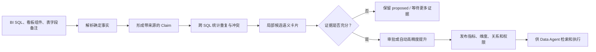
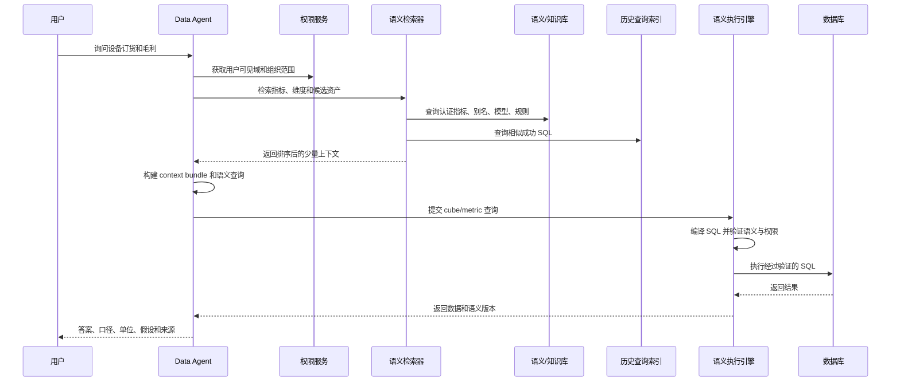

# 从 BI 资产到 Data Agent：现在大家怎样构建，又怎样使用

这份报告只回答两个问题：

1. 现在公开项目和企业实践，究竟怎样把原始数据资产构建成语义层？
2. 语义层建好后，用户问一句业务问题，系统究竟访问了什么、怎样拼接上下文、怎样得到查询和答案？

下面先讲行业事实，再用本项目里的“设备订货/设备利润”做一个完整例子。

---

## 一、先说最重要的结论

当前行业里，没有一个成熟开源项目能自动完成下面整条链路：

```text
海量 BI SQL / 看板组件 / 中文备注
→ 自动发现指标、维度、术语、同义词、统计口径
→ 自动消歧并形成可信企业知识
→ 直接服务 Data Agent
```

公开方案实际上分成了三类：

| 类别 | 它们怎样构建 | 代表项目 | 没有解决什么 |
|---|---|---|---|
| 人工定义语义层 | 数据工程师用 YAML/代码定义指标、维度、关系和权限，再编译成 SQL | MetricFlow、Cube、WrenAI | 不会从海量 BI SQL 自动发现语义 |
| 元数据知识平台 | 连接数据库、BI、任务系统和查询日志，采集 schema、lineage、owner、usage、glossary | DataHub、OpenMetadata | 不会自动判断两个指标是不是同一口径 |
| 企业上下文挖掘 | 把 schema、历史 SQL、文档、代码、术语和用户行为分别建索引，在提问时检索、排序和组合 | LinkedIn 内部 Text-to-SQL 系统 | 公开的是方法，不是完整可复用产品 |

所以，本项目真正有价值的位置是：

```text
现有企业资产
        ↓
【本项目：自动发现、证据化、消歧、形成候选语义】
        ↓
DataHub / OpenMetadata：承载、治理、检索
        ↓
WrenAI / Cube / MetricFlow：执行已经批准的指标和维度
        ↓
Data Agent
```

也就是说，我们不需要重新开发所有东西；但“从 BI 遗产中发现和确认语义”这一段，现成系统确实没有替我们做好。

---

## 二、行业现在究竟怎样构建语义层

### 路线 A：人工编写的语义层

这是 MetricFlow、Cube、WrenAI 最常见的方式。

假设数据库中有：

```text
orders
├── order_date
├── product_id
├── sales_amount
└── profit_amount
```

数据工程师手工告诉系统：

- `sales_amount` 是可求和的基础度量。
- “销售额”指标是 `SUM(sales_amount)`。
- `order_date` 是时间维度，可以按日、月、季度聚合。
- `product_id` 可以连接产品表。
- 哪些角色可以查询，哪些字段需要屏蔽。

系统随后把“销售额按月份和产品查询”编译成正确 SQL。

[MetricFlow](https://github.com/dbt-labs/metricflow) 的核心是把指标定义编译成 SQL；[Cube](https://docs.cube.dev/reference/data-modeling/cube) 进一步提供缓存、API 和访问策略；[WrenAI](https://github.com/Canner/WrenAI) 把模型、规则、查询记忆和 MCP 工具组合成 Agent context layer。

它们的优点是：一旦定义完成，执行非常确定。

它们的缺点也很明显：谁来编写几万个指标和维度？如果企业已有大量 BI SQL，而没有完整的语义工程团队，这条路无法独立解决问题。

### 路线 B：元数据平台自动采集技术上下文

DataHub 和 OpenMetadata 通过 connector 连接：

- 数据库和数仓。
- BI 看板。
- ETL/调度系统。
- dbt 等建模项目。
- 查询日志。
- 数据质量系统。

它们把不同来源转换成统一实体，例如：

```text
Dashboard → Chart → Dataset → Table → Column
                       ↓
                    Lineage
                       ↓
               Owner / Domain / Tag
```

构建后的平台可以回答：

- 这个字段来自哪张表？
- 哪些看板使用了这张表？
- 谁是 owner？
- 有哪些历史 SQL？
- 哪些字段属于 PII？
- 某张表是否已废弃？

[DataHub MCP](https://docs.datahub.com/docs/features/feature-guides/mcp) 已经提供搜索资产、查看 schema、查询 lineage、获取历史 SQL、寻找 SQL context 和提交元数据 proposal 等工具。[OpenMetadata AI SDK](https://docs.open-metadata.org/v1.12.x/api-reference/sdk/ai-sdk) 也把 description、owner、lineage、glossary、tag 和质量结果暴露给 Agent。

但是，如果两个 SQL 都输出“销售金额”，一个含税、一个不含税，平台不会仅凭名称自动知道它们不能合并。这仍然需要本项目这样的证据融合与消歧层。

### 路线 C：LinkedIn 的企业级构建方式

与本项目最接近的公开案例是 LinkedIn 的 [Text-to-SQL for Enterprise Data Analytics](https://arxiv.org/abs/2507.14372)。它面对的也是企业级海量表、重名表、废弃表、内部术语和复杂查询。

他们不是建立一个“万能 prompt”，而是离线构建多类知识索引。

#### 1. 收集哪些来源

- DataHub 中的表名、列名、描述、tag、认证和废弃状态。
- 历史查询日志。
- 代码仓库和 Wiki 中的参考 SQL。
- 用户、团队和产品域的使用行为。
- 常用 join。
- 公司术语和领域知识。
- 权限信息。

#### 2. 从来源中形成什么知识

对表和列形成属性：

- 表/列名称和描述。
- popularity。
- 认证或废弃状态。
- 数据所属产品域。
- 常见 join。
- 历史查询例子。
- 哪些团队经常使用。

#### 3. 不把所有东西做成一个索引

他们分别维护：

1. 表和列的 metadata index。
2. usage 和 common join index。
3. 团队/产品域的 table cluster。
4. 高质量 example query index。
5. domain knowledge 和 jargon index。

不同索引有不同刷新周期。查询历史、表属性和团队使用簇可以定期刷新；新业务知识可以即时加入。

#### 4. 怎样形成“团队常用表簇”

他们根据一段时间内的查询记录，建立类似下面的矩阵：

| 用户/团队 | 表A | 表B | 表C | 表D |
|---|---:|---:|---:|---:|
| 销售团队 | 120 | 95 | 3 | 0 |
| 财务团队 | 2 | 40 | 130 | 80 |
| 设备团队 | 0 | 1 | 5 | 160 |

再根据共同使用行为形成 table cluster。这样，同样问“收入”，销售用户和财务用户检索到的候选表会不同。

#### 5. 为什么这么做

LinkedIn 的内部消融结果很说明问题：只给 schema 时，正确表召回和最终语义质量都很低；加入历史查询、表列属性和团队表簇后明显提升。其中 example query、table cluster 和资产属性贡献最大。换句话说，企业 Agent 需要的是“企业怎样真实使用数据”的证据，而不只是字段名称。

---

## 三、用本项目真实 SQL 演示语义怎样被构建

### 原始输入

本项目真实样例中有如下 SQL：

```sql
SELECT
  temp."c7"  AS "产品LV1",
  temp."c2"  AS "年月",
  SUM(temp."c27") AS "Sum_设备订货",
  SUM(temp."c28") AS "Sum_设备利润"
FROM dmprjdis_pfa.datain_1783070589517_temp temp
WHERE temp."c7" = ?
  AND temp."c0" = ?
GROUP BY 1, 2
```

另外几张图表重复使用同一个临时表，但选择了不同维度：内部分类、国家、合同名称等。

### 第一步：解析确定事实

这一步不需要 LLM。SQL parser 可以确定：

| 观察到的事实 | 提取结果 |
|---|---|
| 物理表 | `dmprjdis_pfa.datain_1783070589517_temp` |
| `c7` 的输出别名 | 产品LV1 |
| `c2` 的输出别名 | 年月 |
| `c27` 的计算方式 | SUM |
| `c27` 的输出别名 | Sum_设备订货 |
| `c28` 的计算方式 | SUM |
| `c28` 的输出别名 | Sum_设备利润 |
| 分组粒度 | 产品LV1 × 年月 |
| 过滤字段 | `c7`、`c0` |
| 未知内容 | 两个 `?` 分别是什么业务参数 |

这里得到的是“事实”，还不是“企业语义”。

### 第二步：把事实变成 claim，而不是直接变成知识

系统建立以下候选陈述：

| Claim | 状态 | 原因 |
|---|---|---|
| `c7` 可能表示“产品LV1” | observed | SQL 明确使用该别名 |
| `c2` 可能表示“年月” | observed | SQL 明确使用该别名 |
| `SUM(c27)` 可能是“设备订货” | observed | SQL 明确使用该聚合和别名 |
| `SUM(c28)` 可能是“设备利润” | observed | SQL 明确使用该聚合和别名 |
| “设备利润”的币种是人民币 | 不成立 | 没有证据 |
| “设备利润”是税后利润 | 不成立 | 没有证据 |
| 查询必须带某种组织过滤 | unresolved | `c0 = ?` 的含义未知 |

为什么要这样做？因为用户在看板里写的名称可能不严谨，甚至同名不同义。Claim 可以保留来源、冲突和未知项，而“知识实体”通常会让人误以为已经确认。

### 第三步：在大量 SQL 中寻找重复和冲突

系统继续统计：

- `SUM(c27) AS Sum_设备订货` 在同一临时表和数据集内重复出现 5 次。
- `SUM(c28) AS Sum_设备利润` 重复出现 4 次。
- `c2 AS 年月` 重复出现 4 次。
- 这些表达式出现在不同组件中，但物理字段和数据集上下文一致。

因此可以把它们从单次 `observed` 提升为“局部得到多次佐证的候选语义”，但仍然不能直接称为企业统一指标。

反例也同时存在：

- `LONG_COL_0` 在样例中对应 3 种不同计算，不能合并。
- “日期”既可能来自公共日历，也可能来自设备状态日期。
- “月份”分别来自销售订单和回款事实。

所以系统的动作应是：

```text
相同名称 + 相同物理实现 + 相同局部上下文
→ 可以折叠为一个局部候选

只有名称相同
→ 不能合并

实现相同但单位、过滤或业务域未知
→ 只能标记为相近候选
```

### 第四步：形成一张“局部语义卡片”

系统最终可以形成这样一张给人看的卡片：

> 候选指标：设备订货
>
> - 当前状态：proposed，尚未认证
> - 局部定义：`SUM(c27)`
> - 物理来源：`dmprjdis_pfa.datain_1783070589517_temp.c27`
> - 适用数据集：集05订货利润
> - 已观察次数：5
> - 常见维度：年月、产品LV1、内部分类、国家、合同名称
> - 已知过滤：查询反复使用 `c7 = ?`、`c0 = ?`
> - 未知：单位、币种、组织范围、`c0` 参数含义、是否允许跨月求和
> - 证据：5 条 SQL 投影和对应报表/组件位置

这张卡片才是业务人员能够审核的东西。

### 第五步：批准后才发布到可执行语义层

假设业务 owner 确认：

- `c27` 是设备订货金额，单位万元，人民币，未税。
- `c28` 是设备毛利金额，单位万元，人民币，未税。
- `c0` 是组织编码，必须按当前用户组织权限自动过滤。
- `c2` 格式为 `YYYYMM`。

系统才发布：

| 语义对象 | 正式内容 |
|---|---|
| 指标 | 设备订货金额 = `SUM(c27)` |
| 指标 | 设备毛利金额 = `SUM(c28)` |
| 维度 | 年月 = `c2`，格式 `YYYYMM` |
| 维度 | 产品一级分类 = `c7` |
| 权限规则 | `c0` 必须限制在当前用户允许的组织集合 |
| 单位 | 万元人民币，未税 |
| 状态 | approved/certified |

然后再发布到 WrenAI、Cube 或 MetricFlow，供 Agent 确定执行。

整个离线构建过程如下：



---

## 四、语义层建好以后，Agent 究竟怎样使用

现在假设正式语义已经批准。用户提出：

> 查看 2026 年 1—6 月各产品一级分类的设备订货金额和设备毛利金额，并找出订货最高的产品。

下面逐步展示系统内部发生了什么。

### 第 0 步：取得用户身份和权限上下文

系统先得到：

```text
用户：张三
所属组织：Orange 系统部
可访问组织编码：ORG_1001、ORG_1003
允许访问指标：设备订货金额、设备毛利金额
禁止访问：合同级明细
```

权限必须在检索前应用。否则即使最终 SQL 有权限过滤，Agent 也可能已经看到了不应该看到的表名、描述或示例 SQL。

### 第 1 步：把问题解析成业务意图

此时 LLM 只做语言理解：

| 意图部分 | 解析结果 |
|---|---|
| 指标 | 设备订货金额、设备毛利金额 |
| 维度 | 产品一级分类 |
| 时间范围 | 202601—202606 |
| 分组 | 按产品一级分类 |
| 排序 | 设备订货金额降序 |
| 输出 | 各产品明细 + 最高产品 |

注意：这一步还没有选择表，也没有生成 SQL。

### 第 2 步：分别访问不同知识索引

系统不会把整个知识图谱塞进 prompt，而是分别检索。

#### 2.1 术语和指标索引

查询：“设备订货金额”“设备毛利金额”“产品一级分类”

返回：

| 候选 | 匹配原因 | 状态 |
|---|---|---|
| 指标 `total_device_orders` | 首选名“设备订货金额”；历史别名“设备订货”“Sum_设备订货” | certified |
| 指标 `total_device_profit` | 首选名“设备毛利金额”；历史别名“设备利润”“Sum_设备利润” | certified |
| 维度 `product_l1` | 首选名“产品一级分类”；历史别名“产品LV1” | approved |
| 其他“订单金额”指标 | 词义相近但属于销售订单域 | rejected for this query |

#### 2.2 资产与 schema 索引

根据前三个语义对象，返回候选模型：

```text
模型：device_order_profit
包含字段：year_month、product_l1、device_order_amount、device_profit_amount
物理来源：dmprjdis_pfa.datain_1783070589517_temp
认证状态：approved
数据域：IPFM / Orange 系统部
```

#### 2.3 历史查询示例索引

检索“同指标 + 同维度 + 相似时间过滤”，返回一条已验证 SQL：

```sql
SELECT product_l1, SUM(device_order_amount)
FROM device_order_profit
WHERE year_month BETWEEN '202601' AND '202606'
GROUP BY product_l1
```

示例的作用不是复制答案，而是告诉 Agent：

- 这个指标以前怎样按产品分组。
- 时间过滤使用什么格式。
- 应使用哪个已批准模型。

#### 2.4 权限和规则索引

返回：

```text
必须添加：org_code IN ('ORG_1001', 'ORG_1003')
金额单位：万元人民币
金额口径：未税
禁止：输出合同名称或合同明细
```

### 第 3 步：对候选资产排序

如果检索出了 20 张可能相关的表，系统先利用以下因素排序：

- 是否直接实现所需 certified metric。
- 是否属于用户所在产品域。
- 是否被同一团队频繁使用。
- 是否有认证状态。
- 是否已废弃。
- 是否有相似的成功查询。
- 是否满足权限。

LinkedIn 的做法是先高召回找一批候选表，再缩小到少量表，之后才展开完整列 schema。这样既减少 token，也减少相似表干扰。

本例最终只保留 `device_order_profit`。

### 第 4 步：拼成一个“小而完整”的上下文包

这就是用户所问的“到底拼接了什么”。Agent 最终接收到的不是整个图谱，而是下面这个 context bundle：

```text
【用户任务】
查询 202601—202606 各产品一级分类的设备订货金额和设备毛利金额，
按设备订货金额降序，并识别最高产品。

【允许使用的模型】
device_order_profit

【指标定义】
1. total_device_orders
   中文名：设备订货金额
   公式：SUM(device_order_amount)
   单位：万元人民币
   口径：未税

2. total_device_profit
   中文名：设备毛利金额
   公式：SUM(device_profit_amount)
   单位：万元人民币
   口径：未税

【维度定义】
product_l1
中文名：产品一级分类
历史别名：产品LV1

year_month
格式：YYYYMM

【强制权限规则】
org_code IN ('ORG_1001', 'ORG_1003')

【已验证查询示例】
SELECT product_l1, SUM(device_order_amount) ... GROUP BY product_l1

【禁止事项】
- 不得查询合同名称和合同明细
- 不得更换指标公式
- 不得猜测其他组织范围

【输出要求】
- 返回产品一级分类、两项金额
- 订货金额降序
- 明确单位和口径
- 给出使用的指标版本和来源
```

这一步通常由一个 context builder 完成，不应完全依赖 LLM 自己从检索结果中随意挑选。

### 第 5 步：优先生成语义查询，而不是自由写 SQL

如果运行时支持 cube，Agent 发出的工具请求可以是：

```json
{
  "cube": "device_order_profit",
  "measures": [
    "total_device_orders",
    "total_device_profit"
  ],
  "dimensions": ["product_l1"],
  "filters": [
    {"field": "year_month", "op": "between", "values": ["202601", "202606"]},
    {"field": "org_code", "op": "in", "values": ["ORG_1001", "ORG_1003"]}
  ],
  "order_by": [{"field": "total_device_orders", "direction": "desc"}]
}
```

这里没有让 LLM自己决定 `SUM(c27)`。公式已经在语义层中锁定。

### 第 6 步：语义引擎编译成 SQL

运行时生成：

```sql
SELECT
  product_l1,
  SUM(device_order_amount) AS total_device_orders,
  SUM(device_profit_amount) AS total_device_profit
FROM device_order_profit
WHERE year_month BETWEEN '202601' AND '202606'
  AND org_code IN ('ORG_1001', 'ORG_1003')
GROUP BY product_l1
ORDER BY total_device_orders DESC
```

语义引擎再将业务视图展开到底层物理字段：

```sql
SELECT
  c7 AS product_l1,
  SUM(c27) AS total_device_orders,
  SUM(c28) AS total_device_profit
FROM dmprjdis_pfa.datain_1783070589517_temp
WHERE c2 BETWEEN '202601' AND '202606'
  AND c0 IN ('ORG_1001', 'ORG_1003')
GROUP BY c7
ORDER BY total_device_orders DESC
```

### 第 7 步：执行前验证

Validator 检查：

- 表和字段是否存在。
- 指标公式是否来自批准版本。
- 时间过滤格式是否正确。
- 组织权限过滤是否存在。
- 是否引用了禁止字段。
- SQL 方言是否能够编译。
- 是否出现未批准 join。

如果权限过滤缺失，系统不能“提醒一下然后继续”，而必须拒绝执行或自动补上。

### 第 8 步：数据库返回后组织答案

本项目没有行数据，因此现在不能伪造实际金额。但如果数据库返回结果，Agent 的最终回答应类似：

```text
2026 年 1—6 月，设备订货金额最高的产品一级分类是「产品A」。

结果按设备订货金额降序排列，金额单位为万元人民币，口径为未税：

产品一级分类    设备订货金额    设备毛利金额
产品A           <数据库值>      <数据库值>
产品B           <数据库值>      <数据库值>
...

使用的语义定义：
- 设备订货金额 v3：SUM(c27)
- 设备毛利金额 v2：SUM(c28)
- 数据范围：202601—202606
- 组织范围：当前用户有权访问的 ORG_1001、ORG_1003
```

### 整个在线使用过程



---

## 五、如果知识还没有批准，Agent 应该怎样表现

这同样是“语义层怎样被使用”的重要部分。

以项目当前真实状态，系统只知道：

- `SUM(c27)` 被多个看板称为“设备订货”。
- `SUM(c28)` 被称为“设备利润”。
- `c0 = ?` 是一个反复出现但意义未知的过滤条件。
- 单位、币种、税口径和组织范围尚未确认。

此时用户提出同样的问题，正确行为不是生成一个看起来合理的 SQL，而是：

```text
我找到了与“设备订货”和“设备利润”高度相关的现有看板逻辑，
分别是 SUM(c27) 和 SUM(c28)。

但当前证据还缺少两项关键信息：
1. 原看板中的 c0 参数是什么组织或权限过滤；
2. 两项金额的单位、币种和含税口径尚未确认。

因此我可以生成候选查询供分析师核对，但暂时不能把结果作为正式企业指标回答。
```

这不是系统能力不足，而是高质量语义层在阻止 Agent 产生“看似正确、实际口径错误”的答案。

---

## 六、回到本项目：应该具体建设哪几个东西

不需要一开始建设一个庞大的知识图谱平台。先建设四个清晰模块。

### 1. Fact Extractor

输入 BI SQL、组件、物理元数据；输出确定事实：

- 表、字段、表达式、聚合。
- join、filter、group、时间粒度。
- 中文别名和来源位置。
- 解析失败和未知参数。

### 2. Claim & Resolution Service

输出：

- 哪些名称和公式在局部反复出现。
- 哪些同名但实现不同。
- 哪些可能是同义词、上下级或相关概念。
- 哪些存在单位、过滤、权限或粒度冲突。
- observed、proposed、approved、rejected 状态。

### 3. Semantic Registry

只保存和发布经过批准的：

- 指标公式。
- 维度与层级。
- 表和字段实现。
- 单位、币种、时间和过滤口径。
- 权限规则和版本。

### 4. Agent Context Builder

根据用户问题和身份，从以下位置取少量内容并拼包：

- 术语/指标索引。
- 资产/schema/lineage 索引。
- 历史成功查询索引。
- 业务规则和权限索引。
- 未知项和禁止推断项。

然后交给 Agent 或语义执行引擎。

---

## 七、用一句话重新定义项目

这个项目不是“从 SQL 生成知识图谱”。

它是：

> 从企业已有 BI 和数据资产中，持续发现带证据的业务语义候选；通过重复使用、血缘、上下文、冲突和治理信息进行保守确认；再把批准后的指标、维度、术语、关系、规则和权限，以可检索、可解释、可执行的形式提供给 Data Agent。

