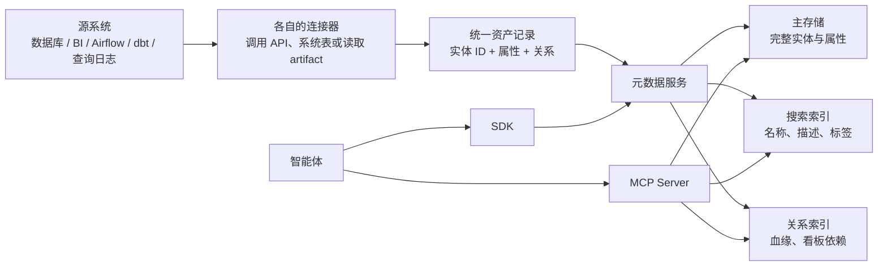

# 路线 2 拆解：资产到底怎样采集，MCP / SDK 到底怎样返回

> 更新时间：2026-08-04  
> 研究范围：DataHub 与 OpenMetadata 这一类“元数据/知识图谱平台”。这份报告只解释公开项目怎样工作，不设计我们的系统。  
> 证据标记：`本机实测` 表示已经在这台电脑运行；`源码核验` 表示读了官方代码；`官方文档` 表示未在本机启动该组件。

## 先用一句人话说明

这类平台并不是让大模型直接阅读整个数据库，也不是凭空“抽取企业语义”。它们先用不同连接器到源系统读取**元数据**，把数据库表、字段、BI 看板、ETL 任务、dbt 模型、历史 SQL 等翻译成统一的资产 ID 和关系；之后 MCP 或 SDK 只是把已经存好的资产按需取给智能体。

完整过程是：



要点有两个：

1. “采集”主要是确定性程序，不是 LLM：连接 API、读系统 catalog、解析 JSON、解析 SQL、生成资产记录。
2. MCP 不负责创造知识。它把搜索、取详情、取字段、取血缘、取历史查询包装成智能体可以调用的工具。

---

## 一、不同来源的资产到底怎样被拿出来

### 1. 数据库和数仓

以 PostgreSQL 为例，一个连接器通常执行下面这些动作：

1. 使用只读账号连接数据库。
2. 从系统 catalog / `information_schema` 或驱动的 reflection 接口枚举 database、schema、table、view、column、主外键和注释。
3. 给每个对象生成稳定 ID。DataHub 使用 URN，例如 `urn:li:dataset:(平台,库.模式.表,环境)`；OpenMetadata 主要使用 FQN，例如 `service.database.schema.table`。
4. 把层级写成关系：表属于 schema，schema 属于 database，字段属于表。
5. 读取 view definition，解析 SQL 后补充表级或列级血缘。
6. 如果配置了使用量/查询历史，再从数据库统计扩展或日志中读取 SQL、用户、时间、执行次数。以 DataHub PostgreSQL 连接器为例，血缘可以使用 `pg_depend`，查询历史可以使用 `pg_stat_statements`。

DataHub 对数据库对象的典型映射是：

| 源系统对象 | DataHub 中的对象 |
|---|---|
| Database | Container |
| Schema | Container |
| Table / View | Dataset |
| Column | Dataset 的 `SchemaMetadata.fields` |
| View SQL | `viewProperties`，并可产生 `upstreamLineage` |
| 历史 SQL | Query 实体 + `querySubjects` + usage / lineage |

因此，“平台采集到一张表”并不是得到一段模糊文本，而是得到一组带类型的记录。后面的本机实验会展示真实记录。

DataHub 官方说明：[PostgreSQL 连接器](https://docs.datahub.com/docs/generated/ingestion/sources/postgres)、[元数据摄取架构](https://docs.datahub.com/docs/architecture/metadata-ingestion)。

### 2. BI 系统：以 Power BI 为例

数据库连接器看不到“哪个看板用了这张表”，所以 BI 必须由另一个连接器采集。

DataHub Power BI 连接器的实际做法是：

1. 用服务主体或用户凭据调用 Power BI REST API。
2. 优先使用 Admin Scanner API，批量扫描 workspace；没有管理员权限时退回普通 API，按 workspace、report 逐个请求。
3. 把 Power BI 对象映射成统一实体。

| Power BI 对象 | DataHub 对象 |
|---|---|
| Workspace | Container |
| Semantic model / Dataset 中的表 | Dataset |
| Report、Dashboard、App | Dashboard |
| Page、Tile | Chart |
| 数据源、M Query、semantic model 表 | 与数据库 Dataset 的 lineage |

4. 读取 semantic model、数据源、report、page、tile 等 API 返回；对 M Query 或可取得的查询表达式继续解析，尝试把 Power BI 表和数仓表对齐。
5. 写入 `Dashboard → Chart → Dataset` 的依赖、owner、description、URL 等属性。

这里最容易误解的一点是：Power BI 连接器不是看图片猜字段。它主要依赖 Power BI API 返回的结构化对象和查询定义。API 没开放、权限不足、M Query 动态生成或使用 gateway 时，血缘就可能缺失。

DataHub 官方说明：[Power BI 连接器](https://docs.datahub.com/docs/generated/ingestion/sources/powerbi)。OpenMetadata 也提供 Power BI API 和 PBIT 文件两条路径：[PBIT 血缘](https://docs.open-metadata.org/v1.12.x/connectors/dashboard/powerbi/powerbi-pbit-lineage)。

### 3. ETL / 调度系统：以 Airflow 为例

Airflow 资产不是通过扫描最终表“反推”的，而是直接从调度系统得到：

- 批量方式：调用 Airflow REST API，或者读取 Airflow 自己的 metadata database，取得 DAG、Task、schedule、owner、tag 和近期 run status。
- 运行时方式：通过 Airflow plugin / listener 或 OpenLineage，在 task 真正运行时发出 input dataset、output dataset、job、run 和 SQL lineage。

批量采集适合回答“有哪些 DAG / Task、谁负责、最近是否成功”；运行时事件更适合回答“这一次运行具体读了什么、写了什么”。只读 DAG 定义但任务内部是任意 Python，平台不能可靠猜出它访问的全部数据，所以生产方案经常把两种方式组合。

OpenMetadata 官方 Airflow 文档明确支持 REST API 或 Airflow 后端库，并可另配 OpenLineage 发送运行时血缘：[Airflow 连接器](https://docs.open-metadata.org/v1.12.x/connectors/pipeline/airflow)、[REST API 与 OpenLineage](https://docs.open-metadata.org/v1.12.x/connectors/pipeline/airflow/rest-api-connection)。

### 4. dbt

dbt 是最清楚的一类，因为 dbt 已经把运行结果输出成标准 artifact。连接器主要读取：

| 文件 | 连接器从中拿什么 |
|---|---|
| `manifest.json` | model、source、compiled SQL、`ref()` / `source()` 依赖、描述、列、tag、test 配置 |
| `catalog.json` | 数据库实际字段类型、字段顺序、部分统计信息 |
| `run_results.json` | model/test 的成功、失败、耗时和错误 |

连接器用 dbt node 的 `database.schema.alias` 与数据库连接器已经采集的表对齐，再把 `depends_on` 或 compiled SQL 转换成 lineage。由此可知：dbt 连接器并没有重新理解业务，它主要翻译 dbt 已经显式声明的模型知识。

OpenMetadata 官方文档对这些文件及用途有逐项说明：[dbt Workflow](https://docs.open-metadata.org/v1.12.x/connectors/database/dbt)。

### 5. 查询日志

查询日志连接器需要的最小输入通常是：

```json
{
  "query": "SELECT ...",
  "timestamp": "2026-07-15T10:00:00+08:00",
  "user": "urn:li:corpuser:zhangsan"
}
```

连接器随后：

1. 解析 SQL 中的表、字段、过滤、聚合和输出列。
2. 结合 `platform + default_database + default_schema` 把短表名解析成统一资产 ID。
3. 保存 Query 实体、使用者和目标 Dataset；在解析成功时补充表级/列级 lineage、读写 operation 和 usage statistics。

这一步高度依赖默认库、默认 schema 和大小写规则。本机实验第一次把 `main` 同时当成 database 和 schema，结果真的产生了错误资产 `main.main.device_order_profit`。修正配置后，正确资产是 `main.device_order_profit`。平台不会知道哪个更符合企业约定，它只会按照配置进行确定性解析。

DataHub 官方说明：[SQL Queries 连接器](https://docs.datahub.com/docs/generated/ingestion/sources/sql-queries)。

---

## 二、统一资产是怎样构建和存储的

### DataHub：一个 URN 下挂多个 aspect

DataHub 的核心单位不是“一大段资产 JSON”，而是：

```text
实体 URN
├── schemaMetadata          字段、类型、nullability
├── datasetProperties       名称、自定义属性
├── editableProperties      人工或 SDK 补充的描述
├── ownership               owner
├── globalTags              tag
├── glossaryTerms           术语
├── upstreamLineage         血缘
└── status                  是否删除
```

连接器输出 Metadata Change Proposal（也缩写 MCP，但这里是 DataHub 自己的“元数据变更提案”，不要和 Model Context Protocol 混淆）。Proposal 可以经 HTTP 或 Kafka 进入 GMS。GMS 把完整 aspect 写入主存储；变化事件再驱动搜索索引和图关系索引更新。于是：

- 按 URN 取完整实体，主要读主存储。
- 搜名称、描述、tag，读搜索索引。
- 查上下游，读关系索引。

这解释了为什么智能体要调用不同工具，而不是一次读取“知识图谱的全部内容”。DataHub 官方说明：[Metadata Serving](https://docs.datahub.com/docs/architecture/metadata-serving)、[Components](https://docs.datahub.com/docs/components)。

### OpenMetadata：Source → 拓扑遍历 → Create 请求 → REST Sink

OpenMetadata 采用实体优先的形式。官方 ingestion runner 把源系统建成拓扑，常见数据库顺序是：

```text
Service → Database → Schema → Table → Column
```

runner 深度优先遍历；每个 producer 产生 `CreateEntityRequest` 或 lineage 等请求，保存父节点上下文后继续子节点。REST sink 对服务器执行 create/update；服务器将实体存入 MySQL/PostgreSQL，并把需要检索的字段发布到 Elasticsearch/OpenSearch。

因此两者解决的是同一问题，但中间格式不同：

| | DataHub | OpenMetadata |
|---|---|---|
| 稳定标识 | URN | FQN / UUID |
| 中间写入单位 | entity + aspect 的 Proposal | Create / Update Entity Request |
| API 风格 | REST + GraphQL | REST entity API |
| 检索 | 搜索索引 | Elasticsearch / OpenSearch |
| 关系 | lineage / graph index | entity relationship / lineage API |

OpenMetadata 官方说明：[Ingestion Framework 深入说明](https://docs.open-metadata.org/v1.12.x/developers/contribute/codebase-deep-dives/metadata-ingestion)、[架构](https://docs.open-metadata.org/v1.12.x/developers/architecture)。本地源码中，拓扑执行器位于 `lab/vendor/openmetadata-src/ingestion/src/metadata/ingestion/api/topology_runner.py`，REST sink 位于 `lab/vendor/openmetadata-src/ingestion/src/metadata/ingestion/sink/metadata_rest.py`。

---

## 三、本机实测：没有业务行数据，连接器究竟生成了什么

### 实验输入

我在 `data-experience/lab` 单独创建了一个 SQLite 数据库，只建结构，不插入任何业务行：

```sql
CREATE TABLE device_order_profit (
  c0 TEXT NOT NULL,
  c2 TEXT NOT NULL,
  c7 TEXT NOT NULL,
  c27 NUMERIC,
  c28 NUMERIC
);

CREATE VIEW device_order_profit_by_product AS
SELECT c7 AS product_l1,
       c2 AS year_month,
       SUM(c27) AS device_order_amount,
       SUM(c28) AS device_profit_amount
FROM device_order_profit
GROUP BY c7, c2;
```

DataHub recipe 只有连接地址、是否包含 table/view，以及 `profiling.enabled: false`。也就是说，实验没有读取或画像任何业务数据。

### 连接器输出

使用官方 `acryl-datahub 1.6.0` SQLAlchemy 连接器离线输出，再向本机 DataHub GMS 写入：

- 发现 2 张表、1 个 view。
- 离线文件产生 29 条 metadata records，涉及 6 个实体。
- 写入服务器时产生 31 条 records；额外记录来自成功解析的细粒度血缘。
- view 额外产生 `viewProperties`、`upstreamLineage` 和 Query 实体。

其中事实表的一条真实 `SchemaMetadata` 被压缩后如下：

```json
{
  "urn": "urn:li:dataset:(urn:li:dataPlatform:sqlite,main.device_order_profit,PROD)",
  "schemaName": "main.device_order_profit",
  "platform": "urn:li:dataPlatform:sqlite",
  "fields": [
    {"fieldPath": "c0",  "nativeDataType": "TEXT",    "nullable": false},
    {"fieldPath": "c2",  "nativeDataType": "TEXT",    "nullable": false},
    {"fieldPath": "c7",  "nativeDataType": "TEXT",    "nullable": false},
    {"fieldPath": "c27", "nativeDataType": "NUMERIC", "nullable": true},
    {"fieldPath": "c28", "nativeDataType": "NUMERIC", "nullable": true}
  ]
}
```

这就是“资产被采集”的具体含义：表头被转换成有稳定 ID、类型和字段列表的机器记录。此时它还不知道 `c27` 的业务口径。

随后我用官方 SDK 写入明确标为“候选、未认证”的补充信息：中文表名、字段历史别名、owner、tag、glossary term、自定义证据状态，并建立一个 Power BI Chart 和 Dashboard 到该 Dataset 的依赖。这个动作模拟的不是自动理解，而是演示**外部抽取结果怎样写进平台**。

所有原始产物都保留：

- 输入 DDL：`lab/input/demo_schema.sql`
- 数据库 connector recipe：`lab/config/datahub_sqlite_to_server.yml`
- 29 条原始事件：`lab/output/datahub_connector_events.json`
- 事件摘要：`lab/output/datahub_connector_event_summary.json`
- SDK enrichment：`lab/scripts/enrich_datahub.py`

---

## 四、真实问题到 MCP 返回：智能体是怎样使用的

假设用户问：

> “按产品看 2026 年上半年设备订货金额，应该用什么表和字段？以前的人怎么查？”

我在本机启动官方 `mcp-server-datahub 0.6.0`，用真实 HTTP MCP 客户端依次调用。下面不是设想，而是 `lab/output/datahub_mcp_calls.json` 保存的实际协议结果。

### 第 0 步：智能体先看到工具，而不是看到所有元数据

MCP `tools/list` 返回工具定义和 JSON input schema。本次启用的关键工具包括：

- `search`
- `get_entities`
- `list_schema_fields`
- `get_lineage`
- `get_dataset_queries`

这告诉模型“可以搜索、取详情、查字段、查关系、查历史 SQL”，但没有把海量资产塞进上下文。

### 第 1 步：搜索候选资产

调用参数：

```json
{
  "name": "search",
  "arguments": {
    "query": "/q device+order",
    "filter": "entity_type = dataset",
    "num_results": 5
  }
}
```

MCP Server 将它转换成 DataHub GraphQL `searchAcrossEntities` 请求，实际返回 `total: 3`，核心候选为：

```json
[
  {"urn": "...main.device_order_profit_by_product,PROD)", "name": "device_order_profit_by_product"},
  {"urn": "...main.device_order_profit,PROD)", "name": "设备订货与利润事实表"},
  {"urn": "...main.main.device_order_profit,PROD)"}
]
```

第三个就是前述错误默认 schema 配置遗留的资产。这说明搜索结果不是“真理”；智能体仍要根据名称、层级、认证状态和详情做选择。

### 第 2 步：按 URN 取实体详情

智能体选中正确 URN，再调用：

```json
{
  "name": "get_entities",
  "arguments": {
    "urns": "urn:li:dataset:(urn:li:dataPlatform:sqlite,main.device_order_profit,PROD)"
  }
}
```

真实返回中包含：

```json
{
  "name": "设备订货与利润事实表",
  "editableProperties": {
    "description": "字段来自 BI 中间表头，不含业务行数据。c27、c28 的中文含义来自历史 SQL 别名，尚不能据此认定正式口径。"
  },
  "properties": {
    "customProperties": [
      {"key": "evidence_status", "value": "observed_not_certified"},
      {"key": "source_kind", "value": "BI_SQL_and_physical_header"}
    ]
  },
  "ownership": {"owners": [{"owner": {"urn": "urn:li:corpuser:zhangsan"}}]},
  "tags": {"tags": [{"tag": {"properties": {"name": "财务指标候选"}}}]},
  "glossaryTerms": {"terms": [{"term": {"properties": {"name": "设备订货金额"}}}]}
}
```

这一步让 Agent 知道：资产相关，但语义仍是候选，不能把 c27 宣布成正式企业指标。

### 第 3 步：只取 schema

`list_schema_fields` 的真实返回：

```json
{
  "fields": [
    {"fieldPath": "c0",  "nativeDataType": "TEXT",    "description": "历史 SQL 中的必填过滤字段；业务含义待确认。"},
    {"fieldPath": "c2",  "nativeDataType": "TEXT",    "description": "历史 SQL 中常被别名为‘年月’；格式待确认。"},
    {"fieldPath": "c27", "nativeDataType": "NUMERIC", "description": "历史 SQL 中常以 SUM(c27) 命名为设备订货。"},
    {"fieldPath": "c28", "nativeDataType": "NUMERIC", "description": "历史 SQL 中常以 SUM(c28) 命名为设备利润。"},
    {"fieldPath": "c7",  "nativeDataType": "TEXT",    "description": "历史 SQL 中常被别名为‘产品LV1’。"}
  ],
  "totalFields": 5
}
```

### 第 4 步：查以前的人怎样查询

调用 `get_dataset_queries`，真实返回两条 Query。与问题最接近的一条是：

```sql
SELECT
  c7 AS product_l1,
  c2 AS year_month,
  SUM(c27) AS device_order_amount,
  SUM(c28) AS device_profit_amount
FROM device_order_profit
WHERE c2 BETWEEN '202601' AND '202606'
  AND c0 = 'ORG_1001'
GROUP BY c7, c2
```

返回还带有用户 `urn:li:corpuser:zhangsan` 和 subject Dataset URN。Agent 现在获得了三个 schema 中没有的使用事实：历史查询按 `c7,c2` 分组、`SUM(c27)`、并带 `c0` 组织过滤。

### 第 5 步：查哪些看板依赖它

调用 `get_lineage(upstream=false, max_hops=2)`，真实返回 `total: 2`：

```json
[
  {"type": "DASHBOARD", "name": "设备业务经营看板", "platform": "powerbi", "degree": 1},
  {"type": "CHART", "name": "各产品设备订货与利润", "platform": "powerbi", "degree": 1}
]
```

这使 Agent 可以继续检查该看板、owner 或图表定义，也可用依赖关系判断候选表是否真的被相关业务使用。

### 第 6 步：Agent 怎样拼接，而 MCP 不做什么

MCP 到这里返回的是几块结构化上下文。Agent 或上层应用通常把它们整理成这样的受控输入：

```text
用户问题：按产品看 2026 年上半年设备订货金额。

候选资产：main.device_order_profit
资产状态：observed_not_certified，不是已认证指标。
字段证据：c7≈产品LV1；c2≈年月；SUM(c27) 历史别名为设备订货。
历史查询：按 c7,c2 分组，时间 202601~202606，并出现 c0='ORG_1001'。
使用关系：Power BI“设备业务经营看板”直接依赖该资产。
未知项：c0 的正式业务含义、c27 的单位/币种/含税口径均未确认。
```

模型据此可以生成候选 SQL，但高质量回答应同时暴露未知项：

```sql
SELECT c7 AS product_l1,
       SUM(c27) AS device_order_amount
FROM main.device_order_profit
WHERE c2 BETWEEN '202601' AND '202606'
  AND c0 = :organization_id
GROUP BY c7;
```

合理回答不是“这就是正式设备订货指标”，而是：

> 历史资产支持使用 `SUM(c27)`，产品维度为 `c7`，且旧查询要求组织过滤 `c0`。目前元数据明确标记为未认证候选，执行前还需要确定 `organization_id`，并核验金额单位、币种及统计口径。

这就是语义平台的实际作用：它让 Agent 取得可追溯上下文并降低猜测，而不是代替业务确认。

DataHub 官方 MCP 工具与示例：[DataHub MCP 指南](https://docs.datahub.com/docs/features/feature-guides/mcp)、[官方 MCP Server 源码](https://github.com/acryldata/mcp-server-datahub)。

---

## 五、SDK 怎样调用，会返回什么

MCP 面向 Agent；SDK 更适合定时 enrichment、治理程序、后台服务或确定性应用。

本机使用 DataHub Python SDK v2 的实际读取代码只有：

```python
from datahub.sdk import DataHubClient

client = DataHubClient(server="http://localhost:8080")
dataset = client.entities.get(
    "urn:li:dataset:(urn:li:dataPlatform:sqlite,main.device_order_profit,PROD)"
)
```

`dataset` 的真实 Python 类型为 `datahub.sdk.dataset.Dataset`，属性读回结果为：

```json
{
  "display_name": "设备订货与利润事实表",
  "custom_properties": {
    "evidence_status": "observed_not_certified",
    "source_kind": "BI_SQL_and_physical_header"
  },
  "owners": [{"owner": "urn:li:corpuser:zhangsan", "type": "TECHNICAL_OWNER"}],
  "tags": ["urn:li:tag:FinancialMetricCandidate"],
  "terms": ["urn:li:glossaryTerm:device_order_amount"],
  "schema": [
    {"field_path": "c0", "native_type": "TEXT"},
    {"field_path": "c2", "native_type": "TEXT"},
    {"field_path": "c7", "native_type": "TEXT"},
    {"field_path": "c27", "native_type": "NUMERIC"},
    {"field_path": "c28", "native_type": "NUMERIC"}
  ]
}
```

完整代码与真实 JSON：

- `lab/scripts/read_datahub_sdk.py`
- `lab/output/datahub_sdk_readback.json`

写入则使用 `client.entities.upsert(entity)`。本机 enrichment 脚本创建了 Tag、GlossaryTerm、Dataset、Chart、Dashboard 并返回对应 URN，见 `lab/scripts/enrich_datahub.py`。

需要注意：本次安装的 DataHub 1.6.0 仍对 SDK v2 发出 `ExperimentalWarning`，并警告某些 upsert 可能覆盖同一 aspect。这不是概念问题，而是生产采用前必须验证的版本稳定性和合并语义。

官方 SDK 说明：[Main Client](https://docs.datahub.com/docs/python-sdk/sdk-v2/main-client)、[Entities](https://docs.datahub.com/docs/python-sdk/sdk-v2/entities)。

---

## 六、OpenMetadata 的 MCP / AI SDK 实际在服务器内部做什么

这一部分完成了官方源码核验，但没有在本机再启动一套完整 OpenMetadata 服务，所以返回示例标记为“官方文档”，不是“本机实测”。

### MCP 协议调用

客户端向 `/mcp` 发标准 JSON-RPC，例如：

```json
{
  "jsonrpc": "2.0",
  "id": 1,
  "method": "tools/call",
  "params": {
    "name": "search_metadata",
    "arguments": {"query": "sales"}
  }
}
```

官方文档示例的响应仍是 MCP `result.content`，其中 `content[0].text` 是搜索结果文本，列出 entity type、FQN、description、service、owners 和 tags 等信息。随后可用 FQN 调 `get_entity_details`，取 database/schema、columns、owner、tag、tier 等详情。

源码揭示了这两个工具并没有另建一份 AI 专用知识库：

- `SearchMetadataTool` 构造搜索请求，调用服务器现有的 `Entity.getSearchRepository().search(...)`，选择名称、FQN、描述、service、owner、tag、tier 和列名等关键字段，并限制结果规模。
- `GetEntityTool` 先做查看权限校验，再调用 `Entity.getEntityByName(entityType, fqn, fields, ...)` 读取实体；对大表字段分页，并按 response budget 裁剪，避免把整个 catalog 塞进模型上下文。

本地源码位置：

- `lab/vendor/openmetadata-src/openmetadata-mcp/src/main/java/org/openmetadata/mcp/tools/SearchMetadataTool.java`
- `lab/vendor/openmetadata-src/openmetadata-mcp/src/main/java/org/openmetadata/mcp/tools/GetEntityTool.java`

这说明 OpenMetadata MCP 的真实角色也是“授权过的搜索/实体 API 适配器”。官方调用与返回格式：[MCP Tool Reference](https://docs.open-metadata.org/v1.12.x/how-to-guides/mcp/reference)。

### AI SDK

官方 `data-ai-sdk` 先连接 OpenMetadata 并使用 bot JWT，然后：

```python
tools = client.mcp.list_tools()
result = client.mcp.call_tool(
    "search_metadata",
    {"query": "sales"}
)
```

SDK 也能把工具定义转换成 OpenAI / LangChain 可使用的 tool schema。它没有改变底层结果：调用仍落到 OpenMetadata MCP 工具，返回标准 MCP content。官方说明：[OpenMetadata AI SDK](https://docs.open-metadata.org/v1.12.x/api-reference/sdk/ai-sdk)。

### 语义搜索是另一条可选路径

OpenMetadata 的 `semantic_search` 会把 query 转成 embedding，调用 OpenSearch KNN，并返回 type、FQN、owner、tags 和 score。它需要配置向量模型和 OpenSearch；这与普通 `search_metadata` 的字段/全文检索不同。embedding 帮助“近义召回”，但结果仍是已有资产，不会自动证明指标口径相同。

官方说明：[Semantic Search](https://docs.open-metadata.org/v1.12.x/how-to-guides/mcp/semantic-search)。

---

## 七、这类平台自动得到什么，不能自动得到什么

| 能从源系统确定性采集 | 只有源系统显式提供或另有 enrichment 才能得到 | 不能仅凭采集结果证明 |
|---|---|---|
| 表、字段、类型、主外键、数据库注释 | owner、tag、domain、glossary term | 两个同名指标就是同一口径 |
| view SQL 与可解析血缘 | BI 描述、dbt description、人工说明 | 金额单位、币种、含税/未税 |
| BI workspace/report/page/tile 结构 | 看板与物理表的映射 | 中文别名一定代表正式术语 |
| DAG/task/run 状态 | 运行时 input/output lineage | 某个历史 SQL 是正确规范 |
| dbt model/ref/test/result | dbt meta 中声明的治理属性 | 高频使用就等于业务正确 |
| 查询文本、用户、时间、次数 | SQL 解析得到的字段/表 lineage | 缺失过滤条件可以安全补猜 |

所以，路线 2 的准确定位是：**它擅长把分散资产变成可寻址、可关联、可检索、可授权调用的上下文图；它本身不自动完成业务语义判真。**

---

## 八、本次实验中真正遇到的限制

1. DataHub CLI / SDK 为 1.6.0，而官方 quickstart 拉起的 GMS 是 1.5.0.6；本次调用成功，但生产环境应锁定兼容版本。
2. SDK v2 明确提示 experimental。
3. 通用 SQLAlchemy 连接器解析 SQLite view 时提示它更期待三段式名称；尽管最终写入了 view 和 column lineage，这说明不同数据库方言需要单独验收。
4. 两条查询日志时间早于 DataHub 默认 usage window，因此 Query 实体成功写入并可由 MCP 返回，但 usage aggregation 报告为 `outside_window`。
5. 一次错误的 default schema 产生了 `main.main.*` 脏资产；改配置不会自动删除旧 URN，需要显式做 stale entity cleanup。
6. OpenMetadata 完成了文档和源码级核验，没有在本机运行第二套完整服务；因此本报告没有把它的官方返回冒充本机结果。

---

## 九、复现实验的最短路径

本次 DataHub 容器在实验完成后停止，但 volumes 和镜像保留。需要复现时：

```bash
cd /Users/sanjiuganmaoling/Desktop/code/data-experience/lab
source .venv/bin/activate
datahub docker quickstart
datahub ingest -c config/datahub_sqlite_to_server.yml
python scripts/enrich_datahub.py
datahub ingest -c config/datahub_queries_to_server.yml
```

另一个终端启动 MCP：

```bash
cd /Users/sanjiuganmaoling/Desktop/code/data-experience/lab
DATAHUB_GMS_URL=http://localhost:8080 \
DATAHUB_MCP_DOCUMENT_TOOLS_DISABLED=true \
.venv/bin/mcp-server-datahub --transport http
```

然后执行：

```bash
.venv/bin/python scripts/invoke_datahub_mcp.py
.venv/bin/python scripts/read_datahub_sdk.py
```

原始 MCP 结果没有人工改写，完整保存在 `lab/output/datahub_mcp_calls.json`。

