# 路线一到底在做什么：Cube、MDL 和用户问题之间发生了什么？

## 先回答你的直觉

你把路线一理解成一个“中间转换器”，这个理解并没有错，而且已经抓住了它最主要的工作方式：

> 用户不直接面对几十万张物理表，而是先把问题表达成一份结构化的业务查询；语义引擎再依据预先定义好的指标、维度、关系和权限，把这份业务查询编译成真正的数据库 SQL。

但这里容易混淆两个完全不同的东西：

1. **Cube 或 MDL 这样的长期语义模型。**它们在用户提问以前就已经存在，像一本经过整理的“业务菜单和计算手册”。
2. **这一次问题对应的查询 DSL。**它是在用户提问以后临时产生的，像顾客这一次填写的“点菜单”。

用户每问一个问题，系统只应该生成新的“点菜单”，不应该重新发明整本菜单，更不应该临时改变“利润”“订货金额”怎么算。

可以把整条链路想象成餐厅：

- 数据库中的表和字段是仓库里的原材料。
- Cube/MDL 是菜单、菜谱和厨房规则：什么叫“设备订货金额”，用哪些材料，排除哪些状态。
- 用户问题是“我要看 ORG_1001 上半年各产品的订货金额和利润”。
- 查询 DSL 是服务员写下的点菜单：两项指标、一个分组、一个组织条件和一个时间范围。
- 语义引擎是厨房：根据固定菜谱把点菜单变成数据库能执行的 SQL。



图的可编辑源码在 [`路线一从问题到SQL.mmd`](./assets/路线一从问题到SQL.mmd)。

## 先用一分钟认识 Cube 和 MDL 里的对象

### Cube 中的 `cube` 对象

这里第一个 `Cube` 是产品名称；配置里的 `cube(...)` 是这个产品中的一种模型对象。

一个 `cube` 通常围绕一类业务记录组织内容：它从哪张表取数，有哪些可以分组的维度，有哪些可以计算的指标，以及怎样与其他对象连接。

例如，我们的 `DeviceOrders` 对象可以精简成：

```javascript
cube('DeviceOrders', {
  sql: 'SELECT * FROM device_orders',

  measures: {
    deviceOrderAmount: {
      sql: `CASE WHEN status = 'confirmed'
            THEN order_amount ELSE 0 END`,
      type: 'sum'
    }
  },

  dimensions: {
    productL1: { sql: 'product_l1', type: 'string' },
    orgCode:   { sql: 'org_code',   type: 'string' },
    orderDate: { sql: 'order_date', type: 'time' }
  }
});
```

用人话说，它告诉系统：数据来自 `device_orders`；“设备订货金额”是一项指标；“产品一级分类、组织、日期”是查询时可以选择的观察角度。

### WrenAI 中的 MDL

MDL 是“建模描述语言”的名称，不是单独一张表，也不是单独一个指标。它描述的是整个可查询业务世界，里面可以包含：

- **Model**：把物理表包装成语义对象，例如 `device_orders` 对应数据库中的同名表。
- **Relationship**：说明两个 Model 怎样连接。
- **View**：从多个对象中挑选并整理一组适合用户查询的字段。
- **Cube**：在 Wren MDL 中集中声明一组可复用指标和分组维度。
- **Knowledge**：补充“取消单不统计”“组织条件必须填写”等文字规则和历史成功问法。

我们的 Wren Cube 精简后是：

```yaml
name: device_business
base_object: device_orders

measures:
  - name: device_order_amount
    expression: >
      SUM(CASE WHEN status = 'confirmed'
          THEN order_amount ELSE 0 END)

dimensions:
  - name: product_l1
    expression: product_l1
  - name: org_code
    expression: org_code
```

它的意思是：`device_business` 建立在 `device_orders` 之上，对外提供“设备订货金额”，允许按产品和组织观察。

两边都用了 `cube` 这个词，但对象边界不完全相同：Cube 产品中的 `cube` 是基础业务数据模型；WrenAI 的 MDL 是整套语言，而 `Cube` 只是 MDL 里面负责聚合查询的一类对象。它们共同的目标都是把物理字段包装成稳定、可查询的业务成员。

## 一、Cube 和 MDL 不是用户提问时才生成的

还是使用我们 Demo 中的问题：

> 查询 ORG_1001 在 2026 年上半年，按产品一级分类统计设备订货金额和利润。

在用户提出这个问题之前，系统应该已经知道以下业务事实：

- `device_orders` 是设备订货事实表。
- 一行代表一张设备订货单。
- “设备订货金额”使用 `order_amount`，并且只统计 `status='confirmed'` 的记录。
- “设备利润金额”使用 `profit_amount`，同样只统计已确认记录。
- `product_l1` 是产品一级分类，可以作为分组维度。
- `org_code` 是组织条件。
- `order_date` 或 `year_month` 可以表达统计时间。

这些内容组成了 Cube 或 MDL。它们不是这一次问题的临时答案，而是所有问题都要共同遵守的业务契约。

Cube Demo 中的长期模型是 [`DeviceOrders.js`](../demos/route1/cube/model/DeviceOrders.js)。其中“设备订货金额”的核心定义是：

```javascript
deviceOrderAmount: {
  sql: `CASE
          WHEN ${CUBE}.status = 'confirmed'
          THEN ${CUBE}.order_amount
          ELSE 0
        END`,
  type: 'sum',
  title: '设备订货金额'
}
```

WrenAI 中，同一项业务规则写在 [`device_business/metadata.yml`](../demos/route1/wrenai/device_project/cubes/device_business/metadata.yml)：

```yaml
measures:
  - name: device_order_amount
    expression: >
      SUM(
        CASE WHEN status = 'confirmed'
        THEN order_amount ELSE 0 END
      )
```

这两段定义虽然语法不同，表达的意思相同：以后任何人查询“设备订货金额”，都不能由大模型临时决定要不要排除取消单。

## 二、那么 Cube 或 MDL 最初是怎么来的？

它不是完全靠人工从空白文件开始写，也不是大模型看一眼表名就自动得到正确业务含义。比较现实的建设过程分成两部分。

### 第一部分：自动生成物理骨架

系统连接数据库后，可以自动读取：

- 有哪些表和视图。
- 每张表有哪些字段。
- 字段的数据类型。
- 数据库明确声明的主键和外键。
- 部分可以明显识别的时间字段、数字字段和字符串字段。

Cube 的模型生成器可以根据选中的数据库表生成初始 YAML 或 JavaScript；WrenAI 的 `generate-mdl` 流程也会读取数据库结构，为每张表建立一个初始 Model，并生成能够识别的关系。

这一步能生成类似下面的骨架：

```yaml
model: device_orders
columns:
  - order_date: DATE
  - org_code: VARCHAR
  - product_l1: VARCHAR
  - order_amount: DOUBLE
  - profit_amount: DOUBLE
  - status: VARCHAR
```

骨架解决的是“数据库里有什么”，还没有解决“这些东西在公司业务中意味着什么”。

### 第二部分：从已有资产中补充业务含义

真正的指标口径、同义词、默认过滤和权威数据源，需要从公司的使用痕迹中寻找证据。例如：

```sql
SUM(
  CASE WHEN status = 'confirmed'
       THEN order_amount
       ELSE 0
  END
) AS 设备订货金额
```

如果这段表达式反复出现在多个 BI 看板和查询日志中，并且看板字段被命名为“设备订货金额”，系统就可以提出一个候选指标：

> “设备订货金额”可能对应 `SUM(CASE WHEN status='confirmed' THEN order_amount ELSE 0 END)`。

同样可以从现有资产里发现：

- `GROUP BY product_l1` 经常出现，说明它可能是一个常用分析维度。
- `org_code` 经常作为过滤条件，说明组织范围可能是查询必填项。
- 两张表长期使用相同的 Join，可以形成候选关系。
- 看板标题中的“订货额”“订货金额”可以成为同义词。
- 认证看板或高频 SQL 可以成为比一次性查询更强的证据。

但这里必须有一道边界：自动系统可以**提出候选**，不能仅凭一次 SQL 就宣称这已经是公司统一口径。候选要经过冲突检查、SQL 可执行验证、结果对账或业务确认，才适合进入正式 Cube/MDL。

所以，完整的模型建设过程更接近：

```text
数据库表头
  + BI SQL
  + 看板标题和注释
  + 查询日志
  + ETL/dbt/血缘
  + 权限与 Owner
        ↓
自动生成候选模型
        ↓
发现冲突、验证 SQL、少量人工确认
        ↓
进入版本管理的 Cube / MDL
```

在我们的 Demo 中，数据库骨架和业务口径是我为了统一实验条件手工写入的；Demo 并没有声称已经自动从原始 BI 资产生成了完整 Cube/MDL。

## 三、用户提问时真正需要生成什么？

用户提问时，系统不需要再生成上面那本“业务计算手册”。它只需要理解这一次问题想从手册中选择什么。

原问题是：

> 查询 ORG_1001 在 2026 年上半年，按产品一级分类统计设备订货金额和利润。

人读完后会自然拆成五件事：

- 要查的主题：设备订货。
- 要看的指标：设备订货金额、设备利润金额。
- 怎么分组：产品一级分类。
- 查哪个范围：`ORG_1001`。
- 查哪段时间：2026 年 1 月 1 日到 6 月 30 日。

系统内部可以先生成一份与 Cube、WrenAI 都无关的“问题理解结果”：

```json
{
  "subject": "设备订货",
  "requested_metrics": ["设备订货金额", "设备利润金额"],
  "group_by": ["产品一级分类"],
  "filters": [
    {"concept": "组织", "operator": "等于", "value": "ORG_1001"}
  ],
  "time_range": {
    "start": "2026-01-01",
    "end": "2026-06-30"
  },
  "unresolved_terms": []
}
```

这一步只表达“用户想要什么”，还没有使用数据库字段名，也没有写 SQL。

接下来，系统用这份理解结果去检索已经存在的语义模型，得到：

```text
设备订货金额  → DeviceOrders.deviceOrderAmount
设备利润金额  → DeviceOrders.deviceProfitAmount
产品一级分类  → DeviceOrders.productL1
组织          → DeviceOrders.orgCode
统计日期      → DeviceOrders.orderDate
```

完成映射后，才能生成 Cube 接受的查询 DSL。我们 Demo 中的真实 [`query.json`](../demos/route1/cube/query.json) 是：

```json
{
  "measures": [
    "DeviceOrders.deviceOrderAmount",
    "DeviceOrders.deviceProfitAmount"
  ],
  "dimensions": ["DeviceOrders.productL1"],
  "timeDimensions": [
    {
      "dimension": "DeviceOrders.orderDate",
      "dateRange": ["2026-01-01", "2026-06-30"]
    }
  ],
  "filters": [
    {
      "member": "DeviceOrders.orgCode",
      "operator": "equals",
      "values": ["ORG_1001"]
    }
  ]
}
```

WrenAI 的 MCP 调用表达的是同一件事，只是接口不同：

```json
{
  "tool": "query_cube",
  "arguments": {
    "cube": "device_business",
    "measures": [
      "device_order_amount",
      "device_profit_amount"
    ],
    "dimensions": ["product_l1"],
    "filters": [
      "org_code:eq:ORG_1001",
      "year_month:gte:202601",
      "year_month:lte:202606"
    ]
  }
}
```

这就是你所说的“中间领域语言”。它不包含复杂的物理 Join，也不要求提问者知道底层字段来自哪张表。

## 四、大模型怎样才能合理生成这份中间语言？

如果只是把几十万张表的 Schema 全塞给大模型，然后说“请生成 Cube JSON”，结果很难稳定。真正可控的过程应该是先缩小选择范围，再让大模型在一个封闭集合里做决定。

### 第一步：先按用户权限缩小范围

假如用户只能访问设备业务域，系统就不应该把销售、人事、财务的所有指标一起交给大模型。权限过滤要发生在语义检索之前，而不是等 SQL 写完后再补救。

### 第二步：检索与问题相关的少量语义对象

系统根据“设备订货”“利润”“产品一级分类”等词，只取回相关的 Cube、Measure、Dimension、业务说明和历史成功问法。

WrenAI Demo 的 `get_context` 已经展示了这个调用面：输入一个自然语言问题，返回相关 Model、Cube、指标公式、维度以及业务说明。这样大模型看到的是几十个相关候选，而不是全公司的几十万个字段。

### 第三步：让大模型只能选择已有对象

大模型的输出不应该允许它自由发明：

```text
DeviceOrders.total_magic_profit
```

而应该被 JSON Schema 或工具参数限制，只能从检索结果中的正式 ID 里选择。它可以决定：

- 用户说的“利润”最可能对应哪个已存在指标。
- “按产品分类”对应哪个已存在维度。
- `ORG_1001` 是哪个字段的过滤值。
- “2026 年上半年”对应什么日期范围。

它不应该决定：

- 利润公式怎么写。
- 要不要排除取消单。
- 两张表应该怎样 Join。
- 用户能不能查看某个组织。
- 最终数据库 SQL 使用哪一种方言。

前一组属于语言理解；后一组属于已经治理的业务规则和语义引擎职责。

### 第四步：生成以后必须做确定性校验

查询 DSL 生成以后，程序还要检查：

- 指标和维度是否真的存在。
- 当前用户是否有权限访问。
- 指标与维度是否能够通过语义关系连接。
- 是否可能因为一对多 Join 把金额放大。
- 是否缺少必须提供的组织或时间条件。
- 日期和过滤值的类型是否正确。
- 用户所说的词是否存在多个无法区分的候选。

如果公司同时存在“毛利润”“净利润”“项目贡献利润”，系统不能悄悄选择其中一个。合理行为是直接追问：

> 你这里说的“利润”，是设备毛利润、净利润，还是项目贡献利润？

“敢于不回答”是可信系统的一部分，而不是能力不足。

### 第五步：让语义引擎编译，而不是让大模型拼物理 SQL

校验通过后，Cube 或 WrenAI 引擎读取固定的指标定义，生成物理 SQL。Cube Demo 实际生成的核心 SQL 是：

```sql
SELECT
  product_l1,
  SUM(
    CASE WHEN status = 'confirmed'
         THEN order_amount ELSE 0 END
  ) AS device_order_amount,
  SUM(
    CASE WHEN status = 'confirmed'
         THEN profit_amount ELSE 0 END
  ) AS device_profit_amount
FROM device_orders
WHERE order_date >= ?
  AND order_date <= ?
  AND org_code = ?
GROUP BY product_l1
ORDER BY product_l1
```

参数单独绑定为：

```text
2026-01-01
2026-06-30
ORG_1001
```

这里最值得注意的是：用户的问题里没有说 `status='confirmed'`，查询 DSL 里也没有写这个条件。它来自早已确定的指标定义，因此不会随着大模型的措辞变化而丢失。

## 五、我们现有 Demo 到底验证了什么？

这一点必须说清楚。

当前 Cube Demo 的 `query.json` 是预先写好的；WrenAI Demo 的 [`invoke_mcp.py`](../demos/route1/wrenai/invoke_mcp.py) 里，`get_context` 和 `query_cube` 参数也是预先写好的。

因此，当前 Demo 真正证明的是：

```text
已经正确生成的查询 DSL
        ↓
Cube / WrenAI 语义引擎
        ↓
参数化物理 SQL
        ↓
正确查询结果
```

它还没有证明：

```text
任意自然语言问题
        ↓
自动检索正确语义对象
        ↓
稳定生成正确查询 DSL
```

WrenAI 的 `get_context` 确实接受了自然语言问题并返回了相关上下文，但后面的 `query_cube` 参数是我们在代码里明确写入的，不是大模型在本次实验中自动选择的。

换句话说，现有路线一 Demo 已经验证了“后半段编译器”，还没有完整验证“前半段语义理解器”。你的疑问正好指出了现有实验缺失的那一段。

## 六、完整实验还需要补什么？

下一步应该单独增加一个 `自然语言 → 查询 DSL` 实验，而不是把它混在语义引擎测试里。每次运行都要保留：

```text
原始问题
→ 权限过滤后的候选范围
→ 检索到的指标、维度、规则和历史样例
→ 大模型生成的问题理解结果
→ 最终 Cube JSON 或 Wren query_cube 参数
→ 校验结果与歧义说明
→ 引擎编译 SQL
→ 查询结果
```

至少应该测试以下问题：

- 正常问题：指标和维度都唯一明确。
- 同义词问题：“订货额”“订货金额”“订单金额”是否会混淆。
- 歧义问题：“利润”同时对应多个指标时是否会主动询问。
- 缺少条件：没有给出组织范围时是否会提示补充。
- 权限问题：用户提到了无权访问的组织或指标时是否会拒绝。
- 未知术语：问题中出现模型里没有的内部简称时是否会诚实说明。
- 多表问题：需要跨表关系时是否会选对 Join 路径并防止金额放大。
- 连续对话：“那去年呢”能否正确继承上一轮指标、组织和分组。

只有这一组实验通过后，我们才能说路线一不仅会“把正确 DSL 编译成 SQL”，还能够“把人的问题稳定变成正确 DSL”。

## 最后用一句话概括

你的理解可以稍微改写成：

> 路线一提供了一套预先建设、可以执行的业务语言。用户提问时，大模型负责从这套语言中选择正确的指标、维度和过滤条件；语义引擎负责把选择结果确定性地编译成 SQL。Cube/MDL 本身主要在建设阶段由数据库骨架和企业资产共同生成，而不是在每次提问时临时生成。

这套设计真正要解决的，不只是“少写 SQL”，而是让不同用户、不同智能体、不同 BI 工具在查询同一个业务概念时，都被迫使用同一份计算规则。

## 对照的官方资料

- [Cube：创建初始数据模型](https://docs.cube.dev/cube-core/getting-started/create-a-project)
- [Cube：REST 查询对象格式](https://docs.cube.dev/reference/core-data-apis/rest-api/query-format)
- [Cube：AI context](https://docs.cube.dev/docs/data-modeling/ai-context)
- [WrenAI：Model your business](https://docs.getwren.ai/oss/guides/model)
- [WrenAI：MDL schema reference](https://docs.getwren.ai/oss/reference/mdl)
- [WrenAI：Agent-assisted query 架构](https://docs.getwren.ai/oss/concepts/architecture/)
