# 一张没有注释、开发人员也不知道含义的表，智能体还能用吗？

## 先说人话版答案

表本身没有坏，数据库仍然能够查询；但对智能体来说，它像一箱没有标签的零件。

系统可以看见箱子里有五个东西，也能看见它们分别是日期、文字还是数字，却不知道哪个是“合同金额”、哪个是“区域”、哪个状态代表“已确认”。

所以真正受影响的不是 SQL 能不能运行，而是：

> 用户说了一句业务语言之后，系统还能不能找到正确的字段，并且知道应该怎样计算。

如果没有任何线索，答案是不能。此时最安全的行为是承认不知道，而不是根据字段名猜一条看起来合理的 SQL。



## 用一张具体的表来看

假设系统里有这样一张表：

```text
T_A01
  F01  DATE
  F02  VARCHAR
  F03  DECIMAL
  F04  CHAR
```

没有中文注释，字段名也看不出含义。业务用户却问：

> 看一下今年上半年各区域的已确认合同金额。

人类开发人员不知道这张表，自然也不知道：

- `F01` 是签约日期、创建日期还是入账日期。
- `F02` 是区域、组织还是产品。
- `F03` 是合同金额、税额还是数量。
- `F04='1'` 代表已确认、已取消还是其他状态。

大模型同样不知道。它最多根据数据类型猜测 `F01` 可能是日期、`F03` 可能是某个数值，但“可能”远远不够支撑企业查询。

如果让它直接生成：

```sql
SELECT F02, SUM(F03)
FROM T_A01
WHERE F01 BETWEEN ...
GROUP BY F02;
```

这条 SQL 在语法上可能完全正确，业务结果却可能完全错误。这正是企业 Text-to-SQL 最危险的情况：它不是报错，而是安静地给出一个错误数字。

## 有 BI SQL 时，情况就不同了

假设这张表虽然没有注释，但已经被某个 BI 看板使用。我们从看板中找到了：

```sql
SELECT
  F02,
  SUM(CASE WHEN F04 = '1' THEN F03 ELSE 0 END) AS contract_amount
FROM T_A01
WHERE F01 BETWEEN :start_date AND :end_date
GROUP BY F02;
```

这段 SQL 至少告诉系统：

- `F01` 被当成时间过滤字段。
- `F02` 被当成分组字段。
- `F03` 被当成可以求和的数值。
- `F04='1'` 是计算时必须满足的条件。

如果同一个看板的标题叫“区域已确认合同金额”，图表横轴叫“区域”，指标标题叫“已确认合同金额”，系统还能进一步把行为和业务名称联系起来：

```text
F01 可能是合同统计日期
F02 可能是区域
F03 可能是合同金额
F04='1' 可能代表已确认
```

这里我故意使用“可能”。SQL 能告诉我们字段**被怎样使用**，看板文字能告诉我们用户**怎样称呼它**；两者结合后可以形成很强的候选解释，但还不一定等于公司正式定义。

例如，另一个部门的看板可能也叫“合同金额”，却使用 `F04 IN ('1','2')`。这时系统必须把冲突暴露出来，不能擅自挑一个。

## 用户知道、开发人员不知道，知识还能被找到吗？

要看用户的知识有没有留下痕迹。

如果用户虽然没有写文档，却长期通过 BI 看板进行以下操作：

- 把 `F02` 放到“区域”筛选器。
- 把 `F03` 显示成“合同金额”。
- 总是添加 `F04='1'`。
- 总是用 `F01` 选择月份。

那么这些操作本身就是一种没有被整理过的知识。SQL、看板配置、字段别名、筛选器和查询历史，把用户脑中的一部分理解留在了系统里。你的知识挖掘项目可以把这些碎片重新拼起来。

但如果用户的理解只存在于脑中，同时满足：

- 表和字段没有注释。
- 没有 BI SQL 或查询日志。
- 没有看板标题和字段别名。
- 没有 ETL、dbt 或血缘说明。
- 没有人能指出这张表的实际使用者。

那么机器就没有可以观察的证据。此时业务含义不是“算法还没挖出来”，而是输入中根本不存在，只有真正使用这张表的人能够补上。

## 路线一在这里会不会失效？

要把“模型引擎”和“问题理解”分开看。

Cube 或 WrenAI 仍然可以根据数据库结构生成一个模型骨架：表叫 `T_A01`，里面有 `F01` 到 `F04`，分别是什么类型。这部分不会失效。

但是，这个骨架没有告诉系统：

- 用户说“合同金额”时应该选择 `F03`。
- “已确认”应该翻译为 `F04='1'`。
- “按区域”应该使用 `F02`。

因此自然语言到查询 DSL 的前半段会卡住。不是 Cube 无法把 DSL 编译成 SQL，而是系统没有足够依据生成那份 DSL。

换句话说：

```text
只有技术表头时：
用户问题  -X->  查询 DSL  --->  SQL
              找不到可靠映射

补充业务证据后：
用户问题  --->  查询 DSL  --->  SQL
              Cube / MDL 提供稳定映射和计算规则
```

## 你的项目应该怎样处理这种表？

不需要先发动一场庞大的人工填表运动。可以先让系统做大部分机械工作，只把真正有歧义的地方交给人。

对每张表，系统先收集它出现过的所有地方：BI SQL、看板组件、字段别名、筛选器、Join、查询日志、ETL 和血缘。

然后把反复出现的使用方式合并起来。例如：

```text
在 23 个查询中：
- F03 被求和 21 次
- 其中 18 次同时要求 F04='1'
- F02 被用作分组或筛选 20 次
- 相关看板中有 7 个出现“合同金额”
- 其中 5 个明确出现“区域”
```

系统不必立刻创建正式指标，而是先生成一张业务人员能看懂的“候选解释卡”：

```text
我认为这段计算可能是“已确认合同金额”：

金额字段：F03
状态条件：F04='1'
时间字段：F01
常用分组：F02

为什么这样认为：
- 多个独立看板重复使用同一公式
- 看板标题和指标别名出现“已确认合同金额”
- F02 在这些看板中显示为“区域”

还不能确定：
- 金额是否含税
- F01 是签约日期还是确认日期
- F04='1' 是否在所有部门都表示已确认
```

这比给业务人员看一份抽象的元数据 JSON 更容易确认。业务人员只需纠正少数关键问题，而不是从头解释整张数据库。

确认后，系统才把它写成 Cube 或 MDL：

```yaml
measure: confirmed_contract_amount
expression: SUM(CASE WHEN F04 = '1' THEN F03 ELSE 0 END)
label: 已确认合同金额

dimensions:
  - name: region
    expression: F02
  - name: contract_date
    expression: F01
```

从这以后，用户再问“各区域已确认合同金额”，智能体只需要选择已经确认的指标和维度，不必重新猜测 `F01` 到 `F04`。

## 用户提问时，系统应该有三种反应

### 已经有确认过的定义

直接使用正式指标，生成查询 DSL，再交给语义引擎编译 SQL。

### 找到了很像的历史用法，但还没有确认

不要装作已经知道。可以向用户说明：

> 我找到一个常用口径：`F03` 求和并限定 `F04='1'`。相关看板把它称为“已确认合同金额”。是否按这个口径查询？

用户确认一次后，这次查询可以继续，同时把确认结果保存下来。

### 什么证据都没有

直接说明无法判断：

> 当前只有 `F01` 到 `F04` 的技术字段，无法判断哪个字段代表合同金额或区域。请提供一个使用该表的看板、SQL，或者指定熟悉该表的业务人员。

这不是失败，而是系统在信息不足时拒绝编造。

## 没有真实数据会少知道什么？

你的项目没有数据本身，因此即使有 SQL，也无法直接检查：

- `F04` 实际有哪些值，各自出现多少次。
- `F03` 是元、万元还是其他币种。
- `F02` 是否真的是有限的区域集合。
- `F01` 有没有大量空值或异常日期。
- 某个 Join 在真实数据上会不会把金额重复放大。

这不妨碍系统从 SQL 和看板中提取候选语义，但必须把“从资产中推断的含义”和“经过数据验证的事实”分开记录。

如果以后允许在数据库端执行受控检查，而不读取明细，可以只返回空值率、去重数量、枚举频次、主键唯一性和 Join 基数。这会显著提高确认质量，又不需要把业务数据复制出来。

## 最后只记住一句话

> 没有注释的表不是不能查，而是不会说业务语言。BI SQL、看板配置和查询日志是用户无意中留下的“使用说明”；能找到这些说明，就可以恢复一部分候选语义。什么痕迹都没有时，系统必须找人确认，而不能让大模型补写一个看似合理的故事。
